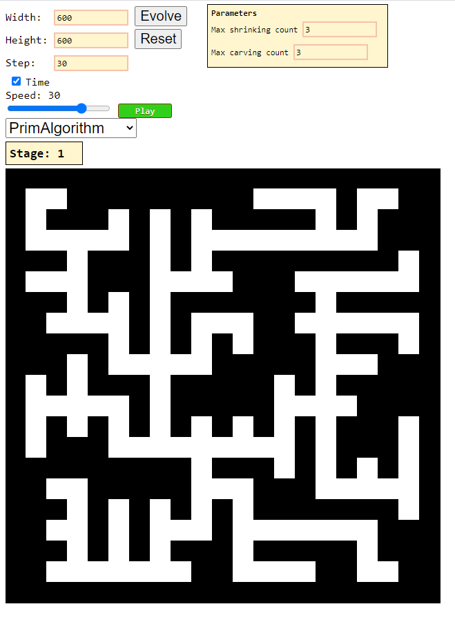
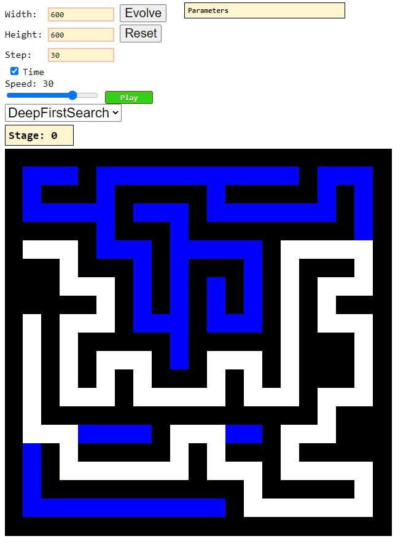

# Maze Generator

Runtime [labyrinth](https://en.wikipedia.org/wiki/Maze_generation_algorithm) generator.  

### [>>Click<<](https://alordash.github.io/MazeGeneration/static/index.html) to open in your browser.  
  
Can use:
1. [Randomized Prim's algorithm](https://en.wikipedia.org/wiki/Maze_generation_algorithm#Randomized_Prim's_algorithm) (with 2, 3 and 4 stages used for generating [caves](https://habr.com/ru/post/537630/))
2. [Randomized depth-first search algorithm](https://en.wikipedia.org/wiki/Maze_generation_algorithm#Randomized_depth-first_search)

Animations included.  
This project uses [p5](https://p5js.org/).
